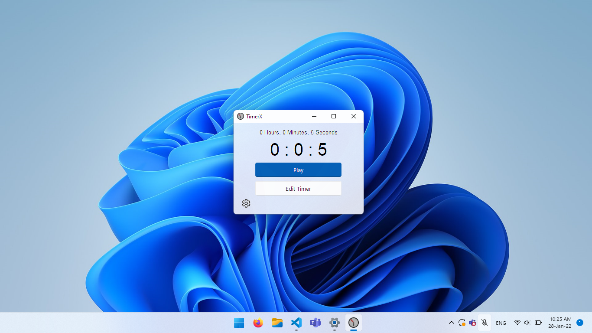

    
    <h1 align="center">TimerX</h1>

    
    
    
    
    
    

### A simple, lightweight, & beautiful timer app built in Python and tkinter.ttk using rdbende's [Sun Valley TTk Theme](https://github.com/rdbende/Sun-Valley-TTk-Theme)

    </img>

> Dark

    </img>

> Light
    
# 🌏Deployed with [Netlify](netlify.app)
    
# 🎯TODO before v1.0
- 🔝~~Add Always on Top option~~ _Released with v0.9, Get it [here](https://github.com/TimerX-App/TimerX/releases)!_
- 🌑~~Dark Mode~~ _Released with v0.9, Get it [here](https://github.com/TimerX-App/TimerX/releases)!_
- ⌨️~~Keybindings to Play/Pause~~ _Released with v0.9, Get it [here](https://github.com/TimerX-App/TimerX/releases)!_
- 🔔~~Notifications~~ _Released with v0.9, Get it [here](https://github.com/TimerX-App/TimerX/releases)!_
# Features coming after v1.0(No promises!)
- ⚙️ ~~Add settings and about page~~ _Added in codebase!(Thanks [nef](https://github.com/not-nef)!)_
- ~~Dynamically resize elements & theme~~ _Added in codebase!(Thanks [nef](https://github.com/not-nef)!)_
- ~~Dark Titlebar~~ _Added in codebase!(Thanks [nef](https://github.com/not-nef)!)_
- ⏱️ Stopwatch Mode

# Supported Platforms
- ✔️ Windows: Tested on Windows 7,10, and 11
- ❔Linux: Tested on Debian-based systems(Raspbian<!-- and ZorinOS-->). Also tested on Ubuntu 21.10. Not tested on Red Hat-based systems(Help Wanted)
- ❌ MacOS: GitHub Actions build succeeds, but fails to work upon install. **Help wanted to debug.**

# Contributing

Read [this](/docs/CONTRIBUTING.md) for instructions!
