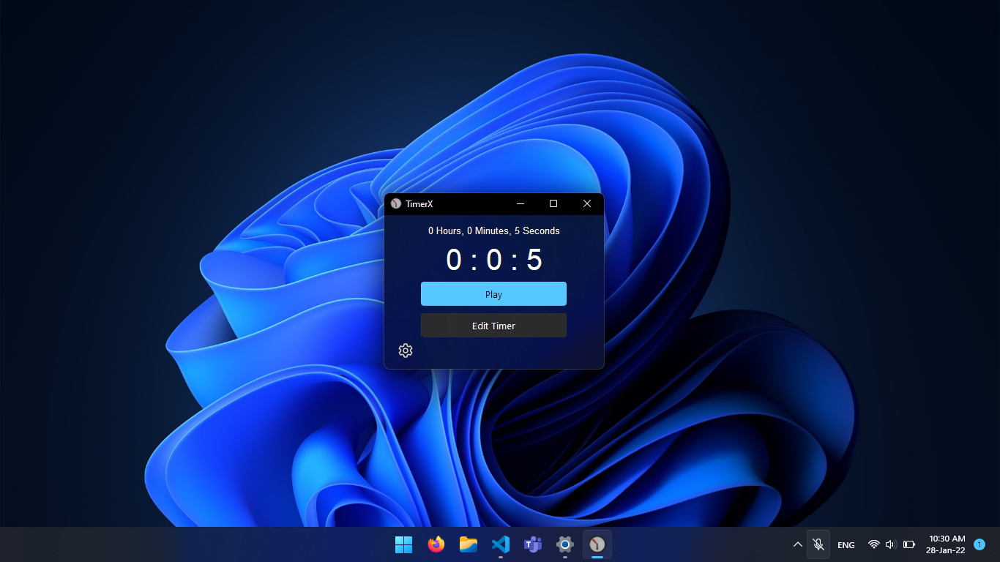

    </img>

#  TimerX

### A simple, lightweight, & beautiful timer app built in Python and tkinter.ttk using rdbende's [Sun Valley TTk Theme](https://github.com/rdbende/Sun-Valley-TTk-Theme)

    </img>

# 🎯TODO before v1.0
- 🔝~~Add Always on Top option~~ _Added in codebase!_
- 🌑~~Dark Mode~~ _Added in codebase!_
- ⌨️~~Keybindings to Play/Pause~~ _Added in codebase!_
- 🔔~~Notifications~~ _Added in codebase!(Windows Only)_
# Features coming after v1.0(No promises!)
- ⚙️ Add settings and about page
- Dynamically resize elements & theme
- Dark Titlebar
- ⏱️ Stopwatch Mode

# Supported Platforms
- ✔️ Windows: Tested on Windows 7,10, and 11
- ❔Linux: Tested on Debian-based systems(Raspbian<!-- and ZorinOS-->). Not tested on Red Hat-based systems(Help Wanted)
- ❌ MacOS: GitHub Actions build succeeds, but fails to work upon install. **Help wanted to debug.**
